# Deploying a shared JupyterHub on the EOSC EU Node

Shared computational infrastructure matters. When a research team needs a common environment (the same software, the same data access, the ability to hand work off between colleagues without a reinstall), a managed JupyterHub is one of the most effective answers available. Every user gets their own notebook server, isolated from their colleagues but pulling from a shared image; a PI can open a colleague's notebook and run it without ceremony.

[JupyterHub](https://jupyter.org/hub) has become a standard piece of infrastructure in data-intensive research across many disciplines, and its value for arts and humanities work is no different. Whether a team is running natural language processing pipelines over a historical corpus, performing geospatial analysis on archaeological survey data, building interactive visualisations of archival collections, or collaborating on quantitative analysis of cultural datasets, a shared JupyterHub removes one of the most persistent friction points in collaborative computational work: the "it works on my machine" problem. A team member in a different city, on a different operating system, with a different version of Python, can open the same notebook and produce the same result.

This post describes how my colleague Emily and I set up a JupyterHub instance for a research project using the [EOSC EU Node](https://open-science-cloud.ec.europa.eu/), the European Open Science Cloud's centrally-managed computational platform. It covers the steps involved in provisioning a virtual machine (VM) through the EOSC portal, the networking subtleties of the PSNC OpenStack environment where our resources were allocated, and the Ansible automation we wrote to make the deployment reproducible and maintainable: what we built today can be rebuilt tomorrow, or adapted for a different project, without starting from scratch.

The EOSC EU Node provides [Interactive Notebooks](https://docs.psnc.pl/spaces/EOSCUserGuides/pages/180097241/Interactive+Notebooks) as a managed service: individual Jupyter sessions, without any server to configure. For a single researcher exploring data, that is likely the right choice. For a team with more demanding computations to run, however, the economics shift quickly towards the use of a dedicated virtual machine.

A Medium notebook session (4 vCPUs, 8 GB RAM) costs 0.5 credits per hour; a single user running it continuously for the 90-day credit window would spend 1,080 credits: half of the 2,000-credit [individual investigator allocation](https://open-science-cloud.ec.europa.eu/about/access-policy). A group project can receive up to 6,000 credits. A Medium VM costs 3,600 credits for the full 90 days, but provides 4x the CPU resources and 8x the memory: 16 vCPUs and 64 GB RAM shared across every member of the team simultaneously, with 100 GB persistent storage and a fully customisable software environment. For collaborative research, self-hosting delivers more compute per credit: resources are shared across the whole team rather than burned on a single session.

## Getting Started with VMs on the EOSC EU Node

The EOSC EU Node is a cloud platform operated by the European Commission, providing virtual machines, storage, interactive notebooks, and other services to researchers affiliated with European institutions. Access is via [MyAccessID](https://myaccessid.eu/), a federated identity system that accepts institutional logins via eduGAIN.

### Before you start

To follow this walkthrough you will need:

- An **EOSC EU Node account**: log in at [open-science-cloud.ec.europa.eu](https://open-science-cloud.ec.europa.eu/) using [MyAccessID](https://myaccessid.eu/) with your institutional credentials. If your institution is connected to the GÉANT/eduGAIN federation, no separate registration is needed.
- A **group project** in the EOSC portal, with a VM credits allocation. Individual accounts receive 2,000 credits; group projects can receive up to 6,000, but investigator access is required to access this: if you think you are entitled to investigator access (for example, as an academic or an RSE) and don't see this in the portal, then your institutional IT team will be able to help.
- An **SSH key pair**. You will import your public key into OpenStack Horizon when launching your VM.

No prior OpenStack experience is required, though familiarity with the command line is assumed for the Ansible sections later in the post.

### Logging in


Logging in via MyAccessID is seamless if your institution is connected to the GÉANT federation: which most are. The standard login flow redirects you to the EOSC dashboard within seconds.


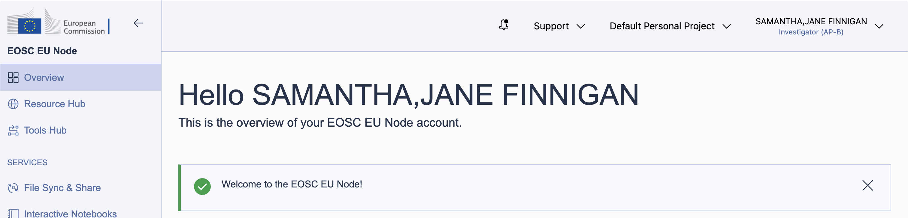

Resources on the EOSC EU Node are managed through *group projects*. A default personal project exists for every user, but to share resources (and the credits that fund them) with colleagues, create a group project. This also allows collaborators to be invited to the shared environment.

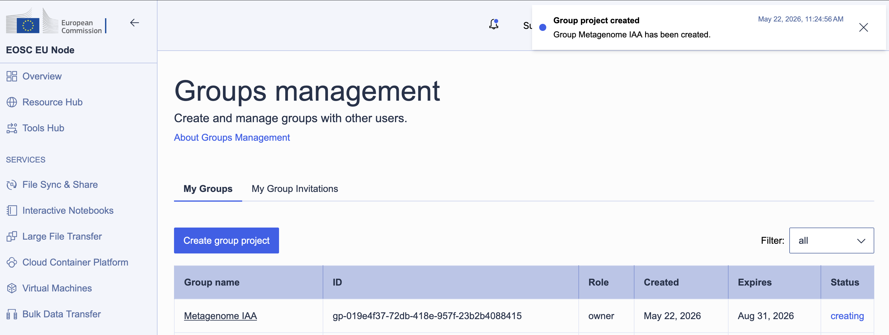

Resource allocation uses a *credits* system: different services and VM sizes draw credits at different rates per day. Group projects are allocated up to 6,000 credits, refreshed over a 90-day window.


## Allocating a virtual machine

With the group project in place, order a VM through the **Virtual Machines** service. The EOSC EU Node offers several flavours: for a shared JupyterHub, the **Medium** tier (16 vCPUs, 64 GB RAM) at 40 credits per day is a reasonable starting point. Over the 90-day maximum period that comes to 3,600 credits, well within a group allocation.

At this stage, we are just reserving the resources that will be consumed by our deployment in OpenStack. This process doesn't spin up anything, it just says to the system: "we would like to reserve this amount of CPU and RAM, please". Setting up the environment is a separate configuration step.

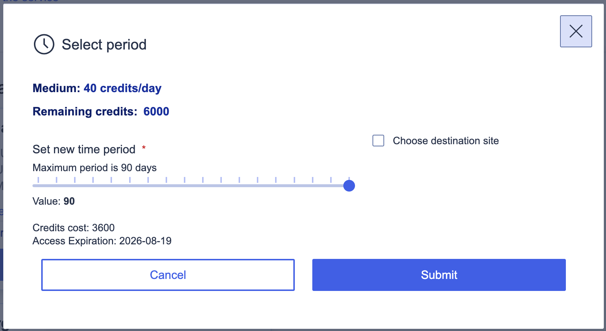

Once the order was submitted, resource allocation took less than a minute. The environment appeared as **Active** in the portal, and clicking **View Externally** opened the OpenStack Horizon dashboard for our project, managed by PSNC (the Poznań Supercomputing and Networking Center).

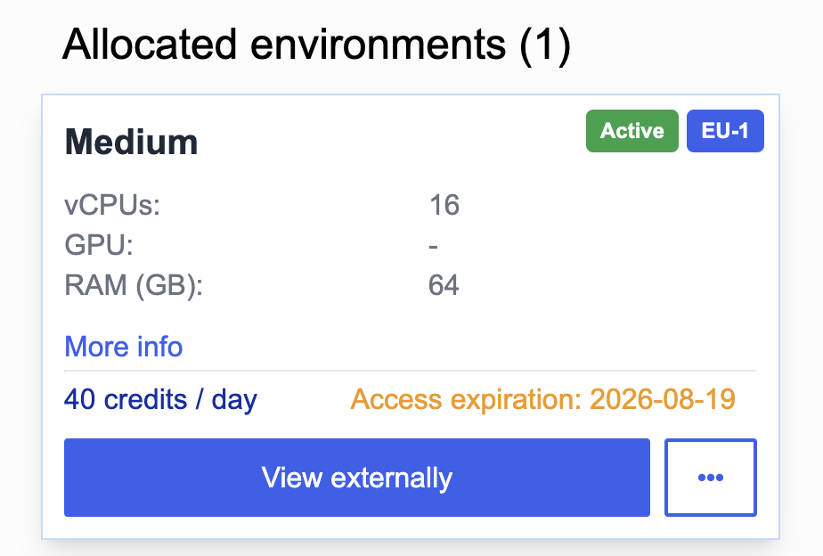

Note the expiry here: if we are still using this resource, we will need to renew our limit allocation through the EU Node interface by 2026-08-19. If we forget to do so, our instance will be torn down, and my expectation is that all data will be lost. I therefore took the opportunity to communicate in writing to my collaborators on the project not to leave any data *only* in the VM, and to always download a local backup after concluding their work. I'll remind them again closer to expiry time, but a stretch-goal would be to set up some form of automated backup task, perhaps using the EOSC EU Node Files service! That's left as an exercise for the reader (and future work for us).

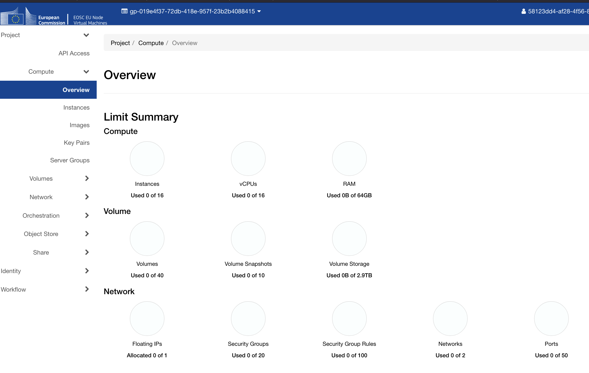

Now that we have access to the dashboard, we can begin to set up our VM resources within our allocated resource limit.

## Navigating the network

This is where things got interesting. In OpenStack, the most natural expectation would be to attach a public network directly to an instance — but PSNC's external network, `PSNC-EXT-PUB1-EDU`, is a *gateway* network. Instances cannot be attached to it directly; instead, it must be used as the upstream gateway of a router, which connects to a private tenant network. Public access is then handled via *floating IPs*, which are drawn from the external pool and associated with specific instance ports.

This is a common enough pattern in OpenStack deployments, but it adds several setup steps that aren't obvious from the Horizon interface alone: hence the write-up here!

### Step 1: Private network and subnet

Create a private network with a subnet: we used `10.10.40.0/24`. Enable DHCP, and set DNS resolvers at the subnet level; Cloudflare's public resolvers (`1.1.1.1` / `1.0.0.1`) work well here.

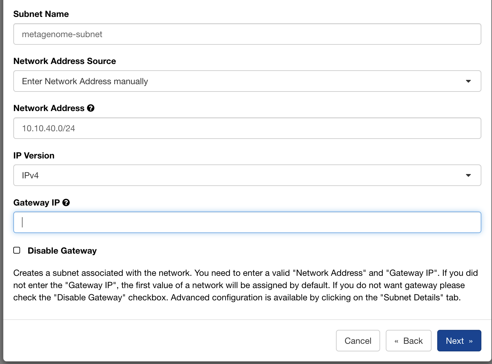

### Step 2: Router

Create a router with `PSNC-EXT-PUB1-EDU` as its external gateway, then attach the private subnet as an internal interface. This gives instances on the `10.10.40.0/24` network a route to the internet via the PSNC gateway.

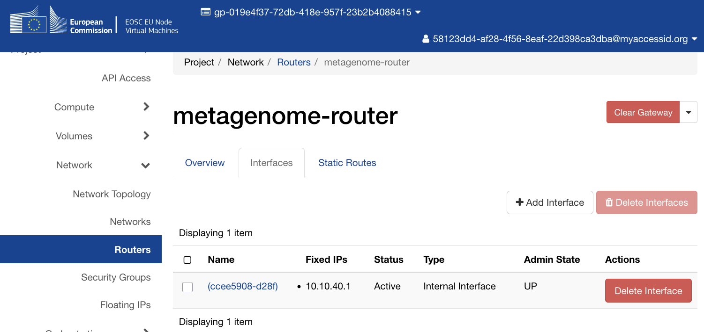

## Launching the instance

With the network in place, launch an instance with the following configuration (we named ours **Metagenome-JH**):

- **Image:** `ubuntu-24.04` (the standard Ubuntu 24.04 LTS cloud image)
- **Flavour:** `C1-NVME-16vCPU-64R-100D` (16 vCPUs, 64 GB RAM, 100 GB NVMe root disk)
- **Network:** your private tenant network
- **Key pair:** your SSH public key, imported via the Horizon interface

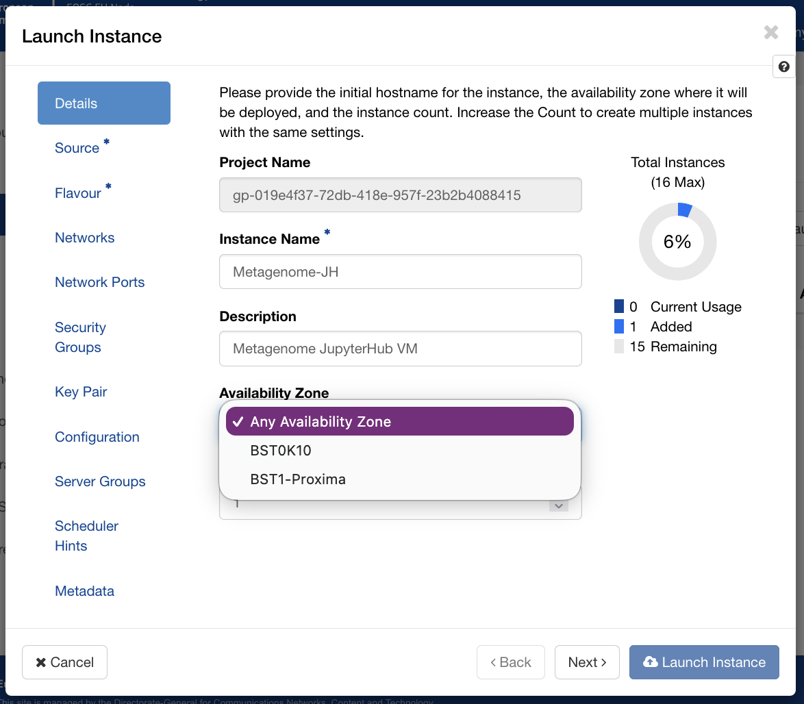

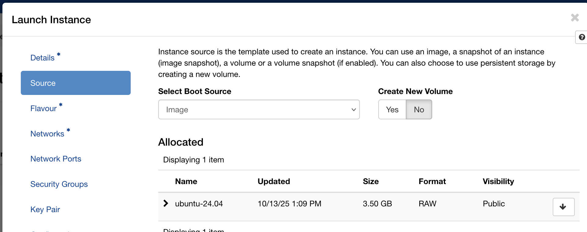

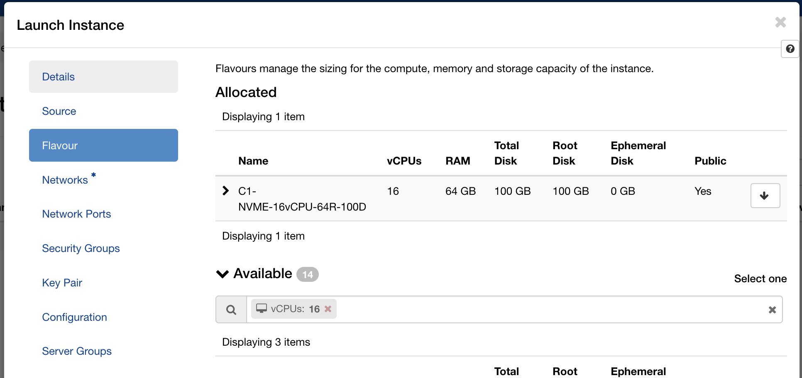

Within a minute the instance appeared in the instances list with status **Active** and power state **Running**.

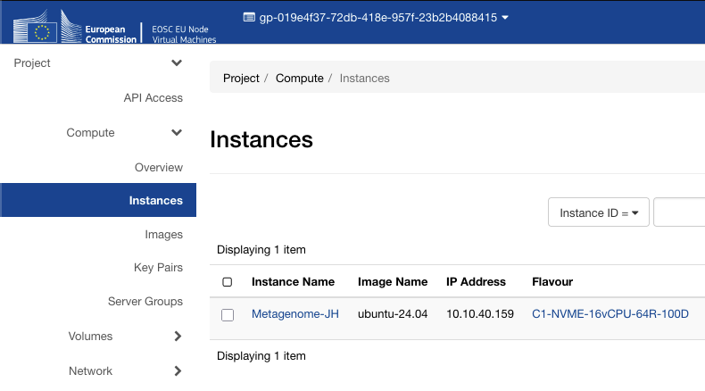

## Floating IP and security groups

The instance gets a private IP on your tenant network. To reach it from the internet, allocate a floating IP from the `PSNC-EXT-PUB1-EDU` pool (the project quota allows one) and associate it with the instance.

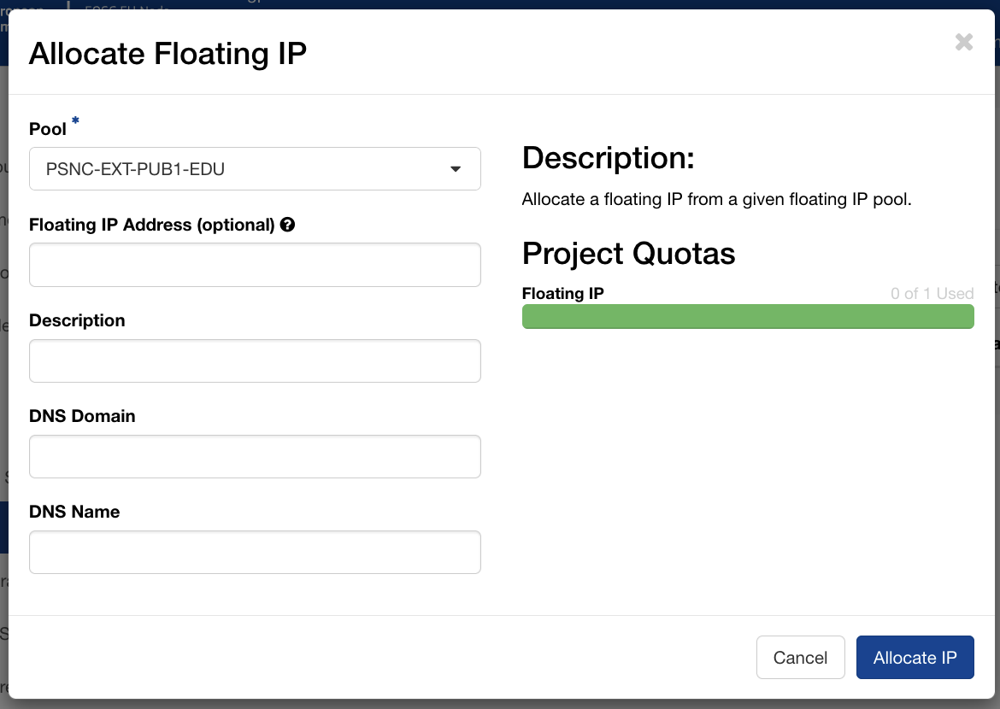

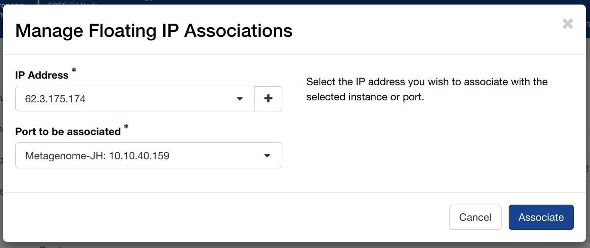

PSNC automatically assigns reverse DNS entries for floating IPs in their pool. A quick `nslookup` confirmed that `62.x.x.x` resolved to `hostname-xxx.man.poznan.pl`, a hostname we could use directly for the Let's Encrypt certificate without needing to configure any external DNS ourselves.

```
$ nslookup 62.x.x.x
Non-authoritative answer:
x.x.x.62.in-addr.arpa  name = hostname-xxx.man.poznan.pl
```

Create a security group with ingress rules for the ports you need, for example:

| Protocol | Port | Purpose |
|----------|------|---------|
| TCP | 22 | SSH access |
| TCP | 80 | HTTP (Let's Encrypt ACME challenge) |
| TCP | 443 | HTTPS (JupyterHub via nginx) |
| TCP | 8000 | Direct JupyterHub access during testing |
| ICMP | — | Ping / diagnostics |

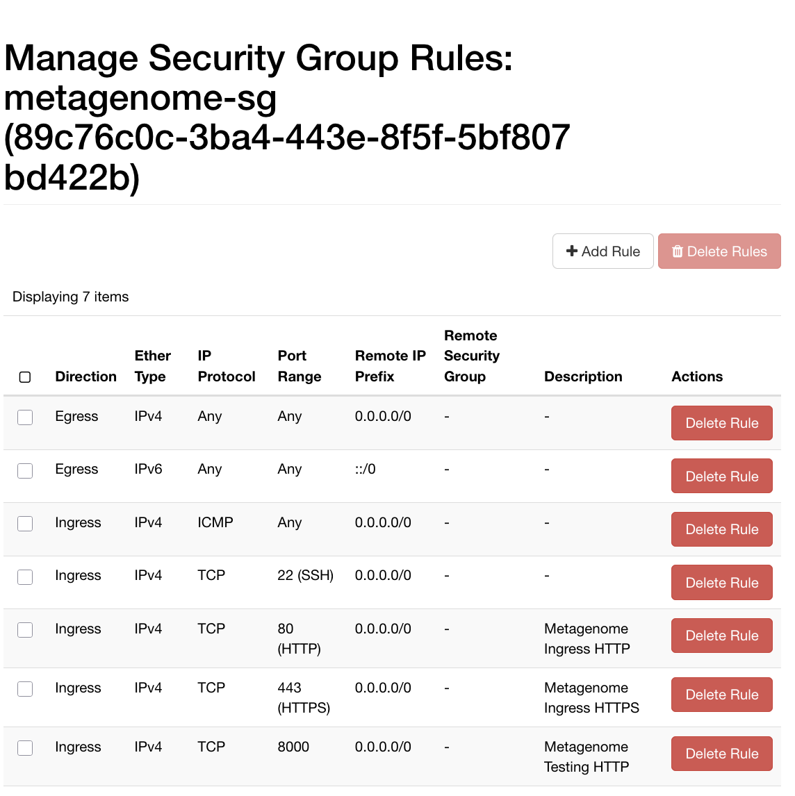

With the floating IP associated and the security group attached, the first SSH connection confirmed the instance was reachable:

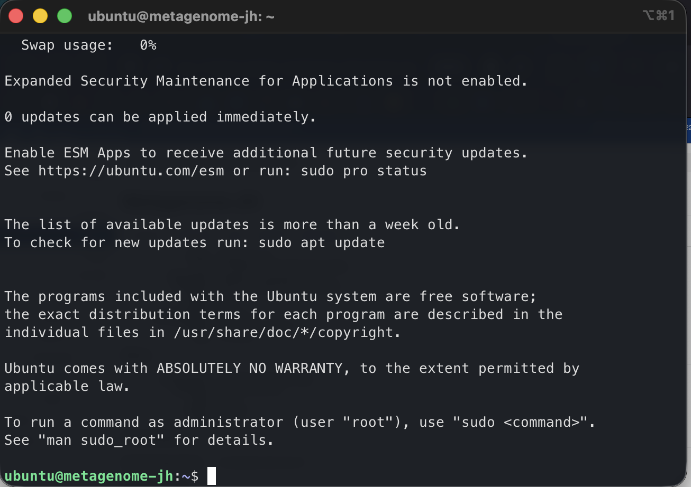

## Automating the deployment with Ansible

Getting a VM running is the beginning, not the end. The next question is: what happens when the instance needs to be rebuilt, when a colleague needs to reproduce the environment, or when we want to apply the same setup to a different project? Clicking through Horizon is fine once; doing it repeatedly, reliably, and without forgetting steps is a different matter.

For this reason I wrote an [Ansible playbook](https://github.com/DurhamARC/jupyterhub-eosc) to codify the entire server configuration. Ansible is an automation tool that describes the desired state of a system as YAML and applies that state idempotently: this means that running it twice leaves the server in the same condition as running it once, and importantly, it won't repeat time-consuming configuration steps if something fails and needs to be fixed further down the chain.

## Design considerations

There were a few design considerations for the service I want to run inside the VM. I wanted my Jupyter server to:

 * Run in Docker for isolation
 * Sit behind a reverse proxy, with nginx terminating connections from the web
 * Use Let's Encrypt for automated provision of TLS certificates (http**s**)

Running JupyterHub and its per-user notebook containers in Docker keeps each user's environment isolated from the host OS and each other, and makes the entire deployment declarative: a `docker-compose.yml` and a small `Dockerfile` describe exactly what runs, and rebuilding from scratch is a single command.

Next, rather than exposing JupyterHub directly on a public port, nginx sits in front of it as a reverse proxy, handling TLS termination and keeping the hub bound to `localhost:8000`. This reduces attack surface and follows established practice for production web services. TLS itself is handled by Let's Encrypt via certbot: PSNC automatically assigns a reverse-DNS hostname to each floating IP in their pool, so we had a valid domain name without needing to own or configure one ourselves, and the certificate renews automatically via a systemd timer. Users get a green lock in their browser, and a secure connection: the `s` in `https`.

## What the playbook roles do

The Ansible playbook is organised into *roles*, each responsible for one logical concern.

**`users`** ensures the default `ubuntu` cloud user is in the `docker` group. On Ubuntu 24.04 cloud images, this user already exists; this role adjusts its configuration rather than creating it from scratch.

**`system`** upgrades all packages on first run and installs Docker CE along with the Compose plugin, using Docker's official APT repository. I chose Docker rather than a system package because the Docker project's own packages track upstream more closely, and include the Compose v2 plugin that the JupyterHub role depends on.

**`security`** does some basic server hardening: it installs and configures fail2ban with an aggressive SSH jail (three failed attempts within a minute earns a 60-minute ban) and hardens the SSH daemon by disabling root login and password authentication. Only key-based SSH access is permitted. The role validates the SSH daemon configuration with `sshd -T` before triggering a restart, so a misconfiguration fails loudly rather than silently locking us out.

**`nginx`** installs nginx and certbot, then uses certbot's `--webroot` mode to obtain a Let's Encrypt TLS certificate for the server's domain name. I chose `certbot certonly --webroot` over `certbot --nginx` (which additionally edits the certificate into the nginx configuration) for separation of concerns: certbot handles certificate issuance only; Ansible templates handle the full nginx configuration including the SSL server block. This produced clean, fully idempotent behaviour.

**`jupyterhub`** is the heart of the deployment. JupyterHub runs in a Docker container built from a small `Dockerfile` that extends the official `quay.io/jupyterhub/jupyterhub` image with two key additions: [DockerSpawner](https://github.com/jupyterhub/dockerspawner), which lets the hub start and stop per-user containers, and [NativeAuthenticator](https://github.com/jupyterhub/nativeauthenticator), which manages user accounts and passwords locally without requiring an external identity provider.

The hub container is managed by Docker Compose. It binds to `127.0.0.1:8000` only (nginx handles all public traffic) and has read-only access to the Docker socket so it can spawn user containers. Each user's container runs the `quay.io/jupyter/datascience-notebook` image, which provides Python, R, and Julia kernels with a broad scientific stack out of the box. User working directories persist in named Docker volumes, so notebooks survive container restarts.

### Challenges along the way

**Docker network label conflict.** My first attempt at writing the playbook pre-created the Docker network using Ansible's `docker_network` module, then had Docker Compose reference it. Docker Compose refused: it found an existing network with the right name, but without the labels it expects to manage. The fix was straightforward: remove the pre-creation task and let Compose own the network entirely. Running `docker network rm` to clear the orphaned network on the server unblocked things immediately.

**The nginx/certbot config conflict.** When working with Ansible, it's worth keeping in mind the principle of *idempotency* mentioned above. Subsequent runs must produce the same result without re-running completed steps. The first version of the playbook used `certbot --nginx` to issue and configure our TLS certificate for use in nginx, but this caused problems: `certbot --nginx` modifies the nginx configuration file in place, but Ansible's template task overwrote those modifications on subsequent runs. This created a fight between certbot's in-place edits and Ansible's template deployments: every subsequent time the playbook ran, Ansible would restore the HTTP-only template, and since the certificate already existed, certbot's task was skipped, leaving port 443 and HTTPS inactive. Switching to `certbot certonly --webroot` and managing the complete nginx configuration (both the HTTP redirect and the HTTPS proxy blocks) as a single Ansible template resolved this permanently.

**The NativeAuthenticator bootstrap problem.** JupyterHub's NativeAuthenticator plugin provides sign-in functionality. I'd configured this with `open_signup = False`, which requires an administrator to approve accounts before users can log in. But the first administrator account has nobody to approve it! Signing up as `admin` and immediately trying to log in produced only "Invalid username or password", a misleading error that obscures the real issue: the account exists but is not yet authorised. The resolution is to add the admin username to `allowed_users` in the JupyterHub configuration, which grants that specific account immediate login rights after signup without requiring external approval.

### What reproducibility buys you

By the time all the above was working, re-running the full playbook against the server produced no changes. Idempotence is the point: the playbook is a specification, not a sequence of commands. If we need to rebuild the server (because the EOSC VM allocation expires, because we want to move to a larger or smaller flavour, or a different host service, or because something goes wrong) we can do so with a **single command** and have confidence the result will match what we have today. We also have a `redeploy-jupyterhub.yml` playbook for day-two operations: rebuilding the hub container after config changes, or wiping the user database entirely when needed (useful during initial setup, when I managed to lock myself out with a generated password).

## The result

JupyterHub is now running on our cloud server, served over HTTPS with a valid Let's Encrypt certificate, on infrastructure funded by the EOSC EU Node. Researchers can log in, create accounts, and start notebook servers immediately, each getting a full data science environment without any local installation.

For teams of arts and humanities researchers, access to a shared, managed JupyterHub like this can change what is practically achievable in a project. Computational methods that require consistent software environments (training a machine learning model on a digitised text collection, running Named Entity Recognition across a large corpus, processing geospatial data from fieldwork, or simply sharing analysis code with a supervisor or external collaborator) become straightforwardly accessible. The EOSC EU Node provides the compute; Ansible ensures it can be reliably rebuilt; and JupyterHub puts it in front of researchers through nothing more than a web browser.

From a CCP-AHC perspective, this is a practical demonstration of the kind of infrastructure we are working to make more accessible to the arts, humanities, and cultural heritage community: reproducibly configured, hosted on European open science resources available to any EU-affiliated researcher, and designed to be adapted and reused rather than rebuilt from scratch for each new project.

---

The full Ansible configuration is available on GitHub at [DurhamARC/jupyterhub-eosc](https://github.com/DurhamARC/jupyterhub-eosc). Give the repo a star if you find it useful.

**Credits:** *The EOSC EU Node is operated by the European Commission. Virtual machine resources at PSNC were accessed via the EOSC EU Node Virtual Machines service. This research was supported by an EPSRC Impact Acceleration Account (IAA) award from Durham University to the **AI Workflows for Permeable Noise-cancelling Metamaterials** project. The preparation of this blog post was supported by the Science and Technology Facilities Council (STFC) [UKRI/ST/B000494/1], as part of the CCP-AHC project.*

**AI use Statement:** *The authors of this work utilised a transformer language model in the development of the Ansible playbook, based on another of the first author's prior playbooks, which have both been tested thoroughly. Models were further utilised in creating the initial outline for the blog post, with significant human edits and alterations applied for us to have confidence in the accuracy and usefulness of the result.*
