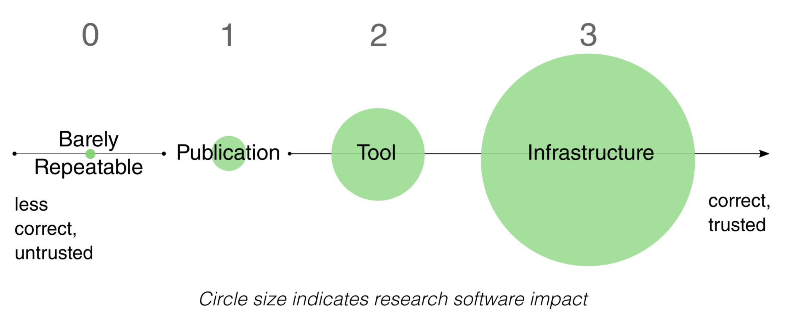

# Publishing Open Source Software: MapReader and the Journal of Open Source Software

The following is adapted from an interview with Katie McDonough and Rosie Wood by Eamonn Bell, which was held online on 6 May 2026.

**Could you briefly introduce yourselves and your relation to the MapReader project?**

(Katie) I’m Katie McDonough, and I now lead the MapReader project. I was part of the team that helped create MapReader on the Living with Machines project at The Alan Turing Institute. I am a Lecturer in Digital Humanities at Lancaster University (but this summer I am joining the History Department at Carnegie Mellon University) 

(Rosie) I’m Rosie Wood. I am a Research Software Engineer (RSE) at the Alan Turing Institute. I joined the MapReader team in 2023 when I first joined the Turing; I was working then as a Junior RSE.

<!-- more -->

There are many other people who worked on MapReader over the years and we’ll just mention a few people. Kasra Hosseini was the original software engineer/data scientist on MapReader, while Daniel WIlson and Kaspar Beelen were both postdoc historians on Living with Machines. Kalle Westerling at the Turing also contributed, particularly on fleshing out the documentation for less technical researchers.

Living with Machines was a digital history project funded by UKRI to create conditions to support cross-disciplinary and collaborative research that could lead to a research software output like MapReader.

**In a few sentences, what does MapReader do and why is it of importance to arts, humanities, and culture researchers? Is it relevant beyond these fields as well?**

MapReader was designed as a way to think through how historians could ask questions of very large collections of maps that have been scanned as digital images. We started by collaborating with the National Library of Scotland to use their very large collection of Ordnance Survey maps.

We wanted to create ways to work with these images as research data, to ask questions that could identify patterns of presence and absence on a national scale instead of just doing case studies, which would be a more traditional historical approach with the same primary source materials. 

For example, on Living with Machines we created novel datasets locating historical railway infrastructure and all buildings in Britain circa 1900, which we could then link up with geolocated microcensus data. This allowed us to explore the impact of living near railway sites on a national scale, going beyond scholarship that had only explored the advantage of the arrival of rail as a question of access to transportation. 

More recently, a number of projects internationally have used MapReader on environmental history projects. Researchers at the University of Richmond are identifying environmentally burdensome sites in US cities using text on fire insurance maps as part of a major public health project to link historical land uses to current community health data.

One important user base is those digitally literate arts and humanities researchers who can code a little but do not know neural network architectures or, say, PyTorch inside out. 

Because we have a lot of worked examples (e.g. using Jupyter notebooks) and the documentation is robust, we have had users with little prior experience with computer vision get to grips with MapReader after even just a few hours.

It’s true that it’s not exactly point-and-click, but this is the consequence of a deliberate decision within Living with Machines. We chose to do less front-end development, which can age badly. Instead, we focused on tools and libraries that can be reused by other developers in their own applications.

We had users of MapReader outside of the humanities from the very early on, in fact. Evangeline Corcoran and Sebastian Ahnert, who were working on plant phenotype identification saw a lot of promise in the way we were approaching the image classification models in MapReader. 

What had initially been used to fine-tune models to identify railway infrastructure in scanned map tiles [was then reused to improve performance in their classification task](https://www.frontiersin.org/journals/plant-science/articles/10.3389/fpls.2025.1443882/full), which related to a research question in a completely different field.

**How did you first hear about the [Journal of Open Source Software (JOSS)](https://joss.theoj.org/), and why did you make the decision to submit MapReader to the Journal?**

There are not many arts and humanities software projects (yet\!) published by [JOSS](https://joss.theoj.org/) and it may not be so well known in our community. Some research software engineers (RSEs) at the Turing review for the journal, but our team did not have any prior experience with it. 

We felt that a new publication in JOSS would complement [one of the initial MapReader publications](https://dl.acm.org/doi/10.1145/3557919.3565812), especially given developments in the code that had taken place since then. This gave us a chance to present the project in a different way, as something that has delivered a more mature piece of research software. 

We were inspired by a prior digital humanities submission to JOSS, namely Lauren Tilton and Taylor Arnold’s [Distant Viewing Toolkit](https://joss.theoj.org/papers/10.21105/joss.01800). We spoke with Lauren and Taylor and learned that they’d found the process productive. 

We’d also been in touch with the DHTech ADHO Special Interest Group, who have been advocating for community code review within digital humanities. Because of the scale of the library, and because some of their members also review for JOSS, they recommended that we consider submitting.

**Could you briefly describe the process of working with JOSS from submission to publication?**

In the beginning we looked at the documentation for the project, and worked through the checklist that JOSS provides as a part of the pre-submission process. This involved some initial tidying up of the codebase. 

The JOSS review process [takes place entirely online using GitHub’s collaboration features](https://github.com/openjournals/joss-reviews/issues/6434), such as issues and pull requests. 

An editor is assigned to your submission, and they become your main point of contact. The editor co-ordinates peer-reviewers, who are assigned to your project and also interact with you via GitHub. 

In particular, if a reviewer requested a change to the code, we could create an issue against our own repository and make the changes required to close it. Once this issue was closed, this would then be mentioned in the issue for the review as a whole. 

It also made a nice change from working with conventional academic publishing platform portals, which are often not designed with usability or digital research artefacts in mind.

Some familiarity with GitHub is required, but the editors and peer reviewers were responsive and willing to help us if we encountered any issues with the process. 

We also had to write a short paper to accompany the submission and put it in the software repository, which was already hosted online. 

The first GitHub issue that kicked off the review process got underway in Summer 2023\. The bulk of the work began in early 2024, and everything was wrapped up by September 2024\. There were generally few delays caused by the review process itself.  

**What aspects of MapReader (testing, documentation, packaging, licensing, etc.) required the most work to meet the expectations of the journal?**

Ensuring that the installation and usage documentations were useful was an important step toward getting accepted. Reviewer feedback helped us to improve the way dependencies were managed. 

In general, however, we were well-placed to make a strong submission. One of the advantages of the JOSS review process is that it takes place using tools and processes that the MapReader team were already working with. 

The team and the host institution had first-hand expertise with [The Turing Way](https://book.the-turing-way.org/). This is a team-based, research software development framework that is consistent with many of the open research values shared by the journal. 

Such approaches often encourage the use of collaborative version control systems like GitHub, GitLab, and other “software forges” and set clear expectations about the importance of documentation and distribution. 

Additionally, MapReader and Living with Machines more generally were already committed to using permissive licenses where possible, so there were no concerns there either.

**How has the process of submitting to JOSS influenced collaborative relationships within and beyond the MapReader team?**

Publishing in JOSS gave the team an opportunity to recognise the work that Rosie and others had put into refactoring, adding new features like text-spotting, and updating the documentation. This is reflected in the authorship order for the paper and in the use of the [NISO CreDiT](https://credit.niso.org/) controlled vocabulary to describe research contributions to the repository.

The publication also contributes to the more general aim of recognising the essential role that digital Research Technical Professionals (dRTP) play in producing computationally intensive arts, humanities, and culture research.

There are now some explicit software citation guidelines in the project’s README file, which were inspired by the process of working with JOSS. This should improve the findability and traceability of MapReader by other research teams and by research funders.

**Has publishing in JOSS changed how you think about maintaining, supporting, or evolving MapReader over time?**

First, it made us think more deliberately about versioning, particularly when it comes to defining release versions. 

It also helped understanding the perspective of users who are a bit more at arms length from the project, because the JOSS reviewers are by definition external to the project.

For example, we learned how important it was that licensing information, documentation, and installation instructions are all legible across disciplines and skill levels.

The JOSS paper tracks the development of MapReader in the direction of code as infrastructure. First, it began as a software experiment. It became code used to support a specific research project. Now, it exists as a documented research code \- which can be used as a Python library \- that is in use in other research projects.

/// caption
Levels of reproducibility. The x-axis represents how correct the software is (i.e. how confident we are in the scientific accuracy of the results it produces), whilst the size of the circles represent the extent of research software impact (i.e. how large are the consequences of the code being incorrect). From Harrison et al. (2021). _How reproducible should research software be?_. Zenodo. [https://doi.org/10.5281/zenodo.4761867](https://doi.org/10.5281/zenodo.4761867)
///

The process did not cover everything, though. For example, JOSS reviewers do not verify that our software can be installed and used with specific digital research infrastructures (DRIs). 

In the UK, the latest generation of national supercomputing services will serve users of deep learning models across all UKRI’s research areas. We would like for our software to be adopted in these new infrastructures, and we have already used Baskerville and the national AI Research Resource (AIRR), in addition to Lancaster University’s in-house high-performance computing cluster to understand the portability and performance of MapReader.

Therefore, now is a good time to make sure documentation includes sample high-performance computing (HPC) submission scripts, to make it as easy as possible for new users to get up and running with MapReader on these new systems.

**What would you say to a reader considering submitting their research software to JOSS or to any other journal that welcomes software as part of their submission and review route?**

Go for it\! Not only will it improve the quality of your software, it will help increase capability in your team to work with external collaborators.

However, don’t expect that the assigned reviewers will “get” your field – even at the highest level. This can actually be helpful. Non-domain experts may be able to help you question the most basic assumptions your team makes, and spot software improvements that are not obvious to highly disciplinary teams.

Make sure that all of the basic things are in place before submission. Your experience will be smoother. The advice that JOSS produces to help projects prepare for a submission is really useful. 

For example, their pre-submission checklist could easily be used to improve your software quality, even if you don’t plan to submit just yet.

**What’s next for MapReader and for the team?**

We are planning a more technical paper about large-scale use of MapReader on HPC systems. Rather than adding new features beyond patch classification and text-spotting, we will improve support for FAIR data standards and other practices that support open research.

By enabling IIIF ingest and export, we can increase integration with other software in the area of maps and other digitized images of cultural, environmental, and natural heritage. This includes [Allmaps](https://allmaps.org/), many excellent IIIF viewers, and standards-compliant image annotation codes (such as [IMMARKUS](https://www.infrastructurelives.eu/publications/immarkus-image-annotation-in-x-markus/)).

Since the end of project funding for MapReader, Rosie has been helping other people make community contributions, while Katie has been running training events for new users, sponsored by AHRC, the Institute for Research Software (formerly the Software Sustainability Institute), and the N8 CIR. To support more events, grow the number of users and contributors, and continue to improve MapReader, dedicated time for an RSE and even a Research Community Manager would be ideal\!

—

If you would like your software project to be featured on the CCP-AHC blog, submit your code to the [CCP-AHC Call for Research Software](https://www.ccpahc.ac.uk/activities/codes-eoi/) and email [ccpahc@durham.ac.uk](mailto:ccpahc@durham.ac.uk). We will reach out to you to discuss the best way to showcase your work.

## Resources

**MapReader: Open software for the visual analysis of maps** (*Journal of Open Source Software*, 2024\) [https://joss.theoj.org/papers/10.21105/joss.06434](https://joss.theoj.org/papers/10.21105/joss.06434)

**MapReader: A Computer Vision Pipeline for the Semantic Exploration of Maps at Scale** (arXiv preprint, 2021\) [https://arxiv.org/abs/2111.15592](https://arxiv.org/abs/2111.15592)

**Other Digital Humanities papers in JOSS** [https://joss.theoj.org/papers/tagged/digital%20humanities](https://joss.theoj.org/papers/tagged/digital%20humanities)

**Transformations: A DARIAH Journal (Author Guidelines)** [https://transformations.episciences.org/for-authors](https://transformations.episciences.org/for-authors)

**Alan Turing Institute podcast episode featuring MapReader** [https://youtu.be/T8bmFvlBWbk](https://youtu.be/T8bmFvlBWbk)

**Living with Machines documentary series featuring MapReader**  [https://www.youtube.com/playlist?list=PLuD\_SqLtxSdWMYcu5YQDGqP9AGejg\_cBb](https://www.youtube.com/playlist?list=PLuD_SqLtxSdWMYcu5YQDGqP9AGejg_cBb)

**High Performance Computing and Arts and Humanities Research in the UK**  Katherine McDonough, Software Sustainability Institute blog (2025) [https://www.software.ac.uk/blog/high-performance-computing-and-arts-and-humanities-research-uk](https://www.software.ac.uk/blog/high-performance-computing-and-arts-and-humanities-research-uk)

**Living with Machines: Computational Histories of the Age of Industry**  University of London Press (open-access digital edition) [https://read.uolpress.co.uk/projects/living-with-machines](https://read.uolpress.co.uk/projects/living-with-machines)

**“Maps and Machines: Recent Perspectives on Humanities Research Using AI and Maps”** *Imago Mundi* Forum (2025) [https://www.tandfonline.com/doi/full/10.1080/03085694.2025.2453329](https://www.tandfonline.com/doi/full/10.1080/03085694.2025.2453329)