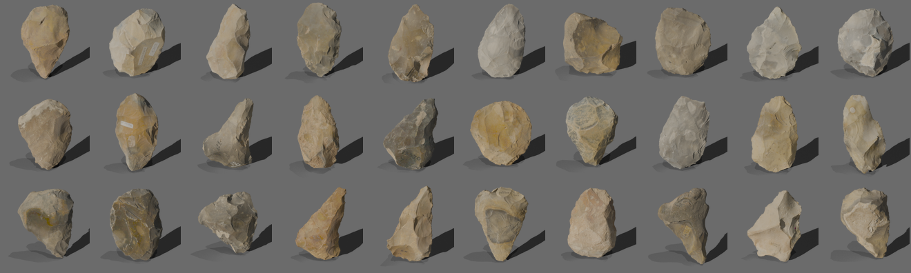

# Archaeological rendering at 2,600 models per hour: HPC for digital heritage collections



When you have 2,637 three-dimensional high-resolution scans of Stone Age handaxes and need thumbnail images for each, you have a few options. You could render them one by one on your workstation, leaving your desktop running for 38+ hours and hoping for the best. Or, if you happen to have access to a supercomputer, you could have them all done in about twenty minutes.

This post describes how we used Hamilton8, Durham University's HPC cluster, to batch-render thumbnail images for a collection of photogrammetric 3D models at the heart of an AHRC-funded research project. It's a small but concrete example of how HPC infrastructure can quietly transform what's practical in arts and humanities research.

## The research project

[*Digital Technologies, Acheulean Handaxes and the Social Landscapes of the Lower Palaeolithic*](https://gtr.ukri.org/projects?ref=AH%2FW009951%2F1) (AHRC grant AH/W009951/1, PI: Professor Mark White) is a £776,000 project running at Durham University from January 2023 to April 2026. Its ambition is to use the British handaxe record– the best-dated Lower Palaeolithic assemblage in the world– to ask two fundamental questions about our deep human past: do the different shapes of Acheulean handaxes reflect distinct early Neanderthal populations in Britain and Europe between ~600,000 and 250,000 years ago? And to what extent were those populations using material culture to signal their individual and group identities?

To answer these questions, the project has produced a definitive digital database of ~3,800 handaxe assemblages using structured-light 3D scanning, capturing the morphology of each tool in far greater detail than any photograph or manual measurement could provide. These scans need to be published: accessible online, viewable in a browser, downloadable for research and 3D printing, and compliant with RCUK open data requirements.

In a 3-way collaboration, Durham University's Department of Archaeology, Library and Collections service and Advanced Research Computing department are working to build that publication platform as a customised [Omeka](https://omeka.org/) installation (widely used in the cultural heritage sector) to be hosted at the university, and going live later in 2026. The 3D models are viewable interactively in the browser. For displaying the artefacts in our Omeka instance, we needed a flat thumbnail image for each item to display in search results and collection grids: but Omeka has no built-in way to generate one from a 3D file. Even if it did, pre-rendering with pretty object lighting takes CPU resource which would delay page loads, so it's favourable to pre-render everything anyway.

## The collection

The models are stored as GLB files (a compact binary format for 3D geometry) with colour captured from the original scan encoded as vertex colours directly on the mesh. There are no texture maps, just raw per-vertex colour data.

## Two problems to solve

Generating a good thumbnail from a 3D scan isn't just a matter of pointing a virtual camera at a mesh and pressing render. We had two things to get right:

**1. Consistent orientation.** A photogrammetric scan captures an object however it happened to be positioned on the scanning turntable. To make the thumbnails comparable across thousands of artefacts, we first apply the *UZY positioning algorithm* (Grosman et al., 2008), which uses the inertia tensor of the mesh surface to orient each artefact objectively: longest axis vertical, primary face forward. We've provided a Python implementation in our open-source [`MeshModelRotate`](https://github.com/DurhamARC/MeshModelRotate) tool, based on a set of translated Matlab scripts originally authored by Dr Gadi Herzlinger at the University of Haifa.

**2. Photorealistic lighting.** We use [Blender](https://www.blender.org/)'s Cycles path-tracing renderer, run entirely headlessly (no display required), to produce 512×512 PNG images with a transparent background and a soft drop shadow. Lighting is tuned to match the interactive 3D viewer used on the Omeka site: a warm amber key light from the upper left, a dim cool fill, and a faint rim light to separate the model from the background. Colour management uses Blender's AgX transform for natural vertex colour reproduction.

## The pipeline

For each GLB file, the pipeline runs two steps:

```
positioning.py  →  <model>_positioned.glb
render_thumbs.py  →  <model>_positioned_thumb.png
```

On a quad-core desktop, each model takes around 52 seconds end-to-end. This includes positioning (eigendecomposition of the mesh inertia tensor) and rendering of each model. At that rate, 2,637 models would take approximately **38 hours** of wall time, even running all cores in parallel.

To position each model, we treat the 3D shape like a physical object and ask "_if this were spinning freely in space, what are its natural rotation axes?_" Every 3D shape has three perpendicular axes around which it would spin most stably: like how a rugby ball naturally spins end-over-end rather than tumbling sideways. These axes are called eigenvectors, and finding them is called eigendecomposition. For a handaxe: the longest axis (tip to base) becomes vertical, the flattest axis (the thin dimension) points front-to-back, and the width axis goes left-to-right. Every handaxe ends up oriented the same way regardless of how it was scanned.

## Enter Hamilton8

Hamilton8 is Durham's Tier-3 HPC cluster, available to researchers across the university. It runs [Slurm](https://slurm.schedmd.com/) for job scheduling and has over 15,000 CPU cores across its shared partition.

Because each GLB is completely independent of all others, this is a textbook *embarrassingly parallel* workload: the kind of task that HPC infrastructure can speed up very, very easily.

### Setup

No administrator access is required. Blender is downloaded as a self-contained Linux tarball and can be run in userspace directly from the `/nobackup` drive, where users get an initial quota of 600GB from the total 2PB of Lustre file storage:

```bash
wget https://download.blender.org/release/Blender4.0/blender-4.0.2-linux-x64.tar.xz
tar -xf blender-4.0.2-linux-x64.tar.xz
```

Python dependencies (`trimesh`, `numpy`, `scipy`) are installed into a standard virtual environment. An additional `numpy` installation is needed for Blender's own bundled Python interpreter, using pip's `--target` flag rather than a system install.

### The Slurm batch array job

We split the 2,637 files into 132 chunks of 20, submitting them as a Slurm array job. Each task runs its 20 models sequentially; all 132 tasks run simultaneously across the cluster.

```bash
#SBATCH --array=0-131
#SBATCH --time=00:30:00
```

The chunk size of 20 is a pragmatic balance: small enough that all tasks dispatch quickly and Slurm can load-balance effectively; large enough that scheduling overhead doesn't dominate over actual computation.

### Results

All 132 tasks were dispatched and running within seconds of submission. The full batch of 2,637 models– both positioning and rendering– completed in approximately **20 minutes** of wall time, compared to an estimated **38 hours** on the desktop workstation. Per-model time averaged **0.5 seconds** on Hamilton8, versus ~52 seconds locally: a roughly **100× speedup** resulting from the massive parallelism a supercomputer provides.

## What makes this an AH&C use case?

The pipeline described here sits squarely at the intersection of several themes the CCP-AHC is exploring:

- **Research software for cultural heritage**: the positioning algorithm and renderer are purpose-built research tools, developed by ARC specifically for this project.
- **HPC for non-traditional workloads**: Blender rendering is not a typical HPC job, but it maps cleanly onto the embarrassingly parallel model that HPC infrastructure is built to accelerate.
- **Open infrastructure**: Blender is open source; the pipeline scripts are MIT-licensed on GitHub; the resulting thumbnails feed into an open Omeka installation.
- **Accessibility**: the setup requires no sudo access, no specialist HPC expertise beyond basic Slurm, and no bespoke software environment: just wget, a python `venv`, and a job script.
- **FAIR and open data**: the pipeline is a practical step toward fulfilling the project's RCUK open data obligations, making 3,800 high-resolution handaxe scans accessible and discoverable online.

## Code and further reading

The full pipeline is available at [github.com/DurhamARC/MeshModelRotate](https://github.com/DurhamARC/MeshModelRotate), including setup instructions for Hamilton8 in the `render/README.md`.

If you have a similar batch processing challenge in your arts or humanities project– image analysis, audio transcription, corpus processing, or 3D geometry– it's worth considering whether HPC could help. The barrier to entry is lower than it might appear.

---

*Grosman, L., Smikt, O., & Smilansky, U. (2008). On the application of 3-D scanning technology for the documentation and typology of lithic artifacts. Journal of Archaeological Science, 35(12), 3101–3110.*
