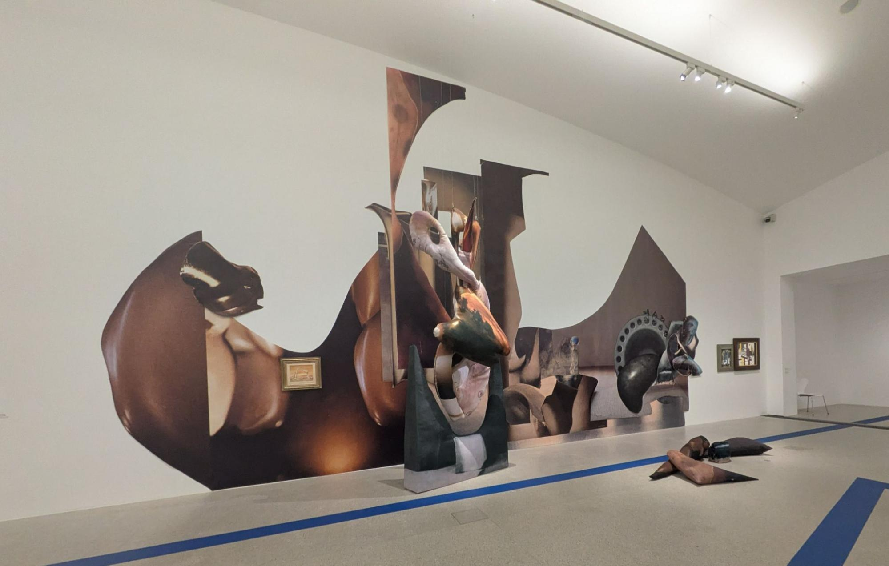
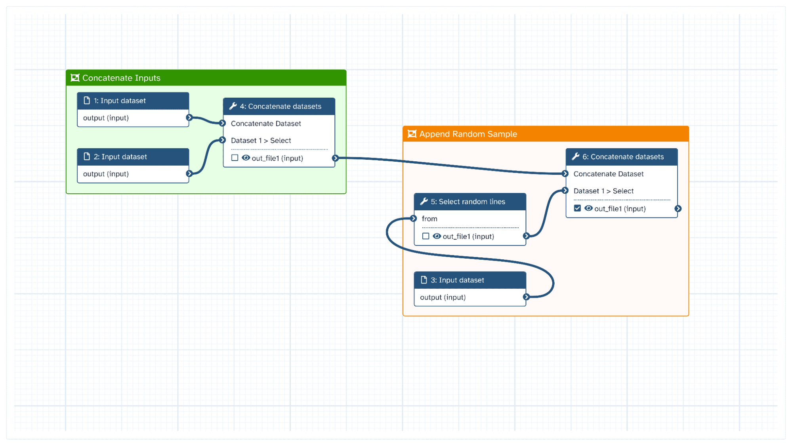

# Developing actionable workflows for the social sciences and humanities with Galaxy

In this blog post, I explain what research workflows are, why they matter for social science and humanities research, and what I learned about turning them into something researchers can actually use—using the Galaxy Project’s workflow manager infrastructure as a concrete example. This report was first prepared for the [ATRIUM TNA blog](https://www.atrium-research.eu/blog/), and also appears online at [https://www.atrium-research.eu/blog/developing-actionable-workflows-for-the-social-sciences-and-humanities-with-galaxy-a-report-on-a-tna-visit-to-acdh-vienna/](https://www.atrium-research.eu/blog/developing-actionable-workflows-for-the-social-sciences-and-humanities-with-galaxy-a-report-on-a-tna-visit-to-acdh-vienna/). 

<!-- more -->

## Funding statement

This blog post was supported by an [ATRIUM Transnational Access Scheme Grant](https://atrium-research.eu/travel-grants/), supporting a visit to the Austrian Centre for Digital Humanities (ACDH) in Vienna in February 2026. ATRIUM is funded by the European Union under Grant Agreement n. 101132163. Views and opinions expressed are however those of the author(s) only and do not necessarily reflect those of the European Union. Neither the European Union nor the granting authority can be held responsible for them. ATRIUM has received support from the EOSC EU Node. 

*Anita Witek, The Collector’s Room, 2025. Installation view, Museum moderner Kunst Stiftung Ludwig Wien (mumok), Vienna. Photograph by Eamonn Bell.*

## Why workflows for the social sciences and humanities?

Many research areas are increasingly curious about the potential for data-intensive methods like deep learning and generative AI models, alongside a growing need for datasets and digital infrastructures. The social sciences and humanities (SSH) disciplines are no exception and are likewise faced with the question of how to best develop, disseminate, and deposit the digital research artefacts that support such research. Sometimes, it's worth exploring models from other fields of research for inspiration for how to achieve this in line with open research principles.

That's where the idea of exploring workflows for SSH research comes in. What's a workflow? It's a description of a set of research actions that can be followed to produce \- or reproduce \- a set of research findings. While it might be more commonly used outside SSH disciplines, the workflow concept is useful for all researchers and especially for research communities relatively new to digital methods. 

Working as part of the UKRI-funded [CCP-AHC](http://www.ccpahc.ac.uk) and [DISKAH](https://culturedigitalskills.org/) infrastructure projects, our experience shows that the majority of arts and humanities researchers were more likely to articulate their digital research needs in terms of commonly occurring patterns of scholarly activity than as a ready-to-run codebase. Hence, I was interested to learn a little more about the promise of workflows, as a way to better understand the research infrastructure needs of SSH researchers.

## Sharing workflows

During my ATRIUM TNA Fellowship at the Austrian Centre for Digital Humanities (ACDH) in Vienna in February 2026, I worked with colleagues to explore the capabilities of existing European digital research infrastructures. Together, we focused on how these infrastructures can support the development of research workflows for the social sciences and humanities.

What appealed to me about this topic was the prospect of starting work on a narrative workflow and ending with an actionable workflow to achieve the research task in question. The former is a workflow written in plain language, while the latter is a workflow that is runnable within an easy-to-use programming environment, but scalable to real-world research workloads.

The [SSH Open Marketplace](https://marketplace.sshopencloud.eu/) (SSHOMP) is a platform maintained and developed by the DARIAH, CLARIN, and CESSDA research infrastructures that allows researchers to deposit scholarly workflows. SSHOMP workflows are currently described in natural language and can be linked to descriptions of datasets, tools, other resources, and even to other workflows. 

Actionable implementations of these SSH workflows will further increase their adoption, by lowering the barrier to reproducing or adapting the most commonly recurring existing digital research methods.

In order to investigate this with a concrete example, I began by identifying a workflow that represented a common need within SSH:

* given a repository of **scanned images of documents containing text** (printed or handwritten);  
* perform batch **automatic text recognition** (ATR) on these page images;  
* perform **named entity recognition** (NER) on the detected page text;  
* filter those named entities corresponding to **geographic locations**;  
* **identify coordinates** for those extracted entities with reference to a knowledge base;  
* and **aggregate these geocoded instances** so that they can be visualised in a simple mapping interface (or further analysed with GIS).

We can identify key steps in this workflow in several entries in the [ATRIUM Workflow Catalogue](https://atrium-research.eu/workflows/), which are today also available on the SSHOMP. As for any engineering task, there are countless acceptable technical implementations of such a workflow. I spent the majority of my brief fellowship exploring those solutions that were possible using the Galaxy workflow engine, because of its ease of access and increased support for research outside of the domain of the natural and life sciences.

## Exploring Galaxy

[Galaxy](https://galaxyproject.org/) is a mature, open-source software for creating and running computational workflows that has its origins in the computational life sciences. The Galaxy project is supported by an active worldwide scientific and technical community. The community provides free access to the data and compute infrastructures to run these workflows at [a number of Galaxy public instances](https://galaxyproject.org/use/?platform_group=public-servers), such as [useGalaxy.eu](http://useGalaxy.eu). Excitingly, there is even a growing Galaxy special interest group (SIG) just for Digital Humanities and Social Sciences with [a homepage filled with ideas for how to use Galaxy to support SSH research](https://galaxyproject.org/community/sig/digital-humanities/).

Galaxy is designed for researcher usability without compromising the prospects for scalability. Researchers can develop, test, and publish actionable research workflows entirely graphically, using a visual programming interface that runs in most modern browsers. The platform abstracts away many of the complexities of sequencing, scheduling, and triggering jobs in established academic high-performance computing (HPC) environments, sometimes called supercomputers or compute clusters. 

This significantly lowers the barrier to entry to large-scale compute resources. It also allows researchers and technicians to prototype new workflows. Once workflows scale up to the long and computationally intensive production runs that produce novel, data-intensive findings of interest to the community, they can run in exactly the same environment. 

Galaxy workflows allow for a high level of reproducibility, too, thanks to a careful approach to persisting and organising workflow artefacts from the beginning to the end of a run. This allows researchers to show their workings, facilitating the development of workflows between research sites via sharing links and other collaboration features. 

Once a workflow has been stabilised and is used to produce candidate research findings, a representation of the complete invocation can be shared, for example with peer reviewers or publishers. This also helps with debugging and optimisation of workflows before they are reviewed and deposited. Many repositories (e.g. [workflowHub.eu](http://workflowHub.eu)) support Galaxy’s *.ga* workflow file format, while tools for porting between workflow specification file formats continue to develop.

## Galaxy in practice: building workflows from tools

We worked primarily with the useGalaxy.eu instance, which is largely maintained and hosted by the University of Freiburg, with the support of [de.NBI](https://www.denbi.de/) and ELIXIR, and is integrated into the European Open Science Cloud (EOSC). [useGalaxy.eu](http://useGalaxy.eu) is available today for general use, even outside of the life sciences. Galaxy has deep integration with popular federated authorisation and authentication infrastructures (AAI) in the European Research Area, such as EGI Check-In. 

Researchers can therefore usually use their institutional login details to get free access to the European instance. Alternatively, users of the [EOSC EU Node](https://open-science-cloud.ec.europa.eu/) can spin up their own instance of Galaxy for development and evaluation purposes. Either way, researchers can quickly start experimenting by building, sharing, or using existing workflows with their own data and questions.

Galaxy workflows can be defined by first selecting from a catalogue of tools. Most tools define a transformation of input data from one form to another, and the output of one tool can be literally “wired” into the input of another. Through this, the researcher can define actionable workflows, which are composed of a series of tools arranged in this way as a sequence of enrichments, aggregations, and summaries of the input data set.

*Illustration of the Galaxy graphical workflow editor. Laila Los, Creating high resolution images of Galaxy Workflows (Galaxy Training Materials). https://training.galaxyproject.org/training-material/topics/galaxy-interface/tutorials/workflow-posters/tutorial.html. Online. Accessed April 21 2026.*

Tools can be as simple as a single-purpose script that sorts the lines of an input file alphabetically by content or as complex as a long-running comparison tool that may take several files as input and draw on more specialised computing resources to produce a detailed output. Almost all tools are open source; some are even interactive, which allows for semi-automated human-in-the-loop workflows when the judgment of a researcher or other expert is demanded, as in the case of data labeling or quality control.

For example, there is a Galaxy tool that makes the popular, [open-source optical character recognition (OCR) tool Tesseract](https://usegalaxy.eu/root?tool_id=tesseract) available within workflows. Automatic text recognition (ATR) is clearly a crucial element of the geocoding workflow described above. The Tesseract tool can therefore be used on a one-off exploratory basis, [to produce OCR for a collection of PDFs](https://www.youtube.com/watch?v=KdJgCJz9A8I), or can be connected to other tool invocations, to perform bulk OCR before some text-processing technique is applied. 

## Bringing your own data

Research data can be uploaded directly into Galaxy via the browser, which triggers the production of a Galaxy dataset and a given workflow can be used immediately with this data. Alternatively, structured data containing URIs to remote datasets can be uploaded. This is one of many options to load larger datasets without downloading data locally first: Galaxy is routinely used with datasets on the order of tens of gigabytes. 

There is tight integration between Galaxy and research data repositories already used by SSH researchers such as [Zenodo](https://training.galaxyproject.org/training-material/topics/fair/tutorials/zenodo-in-galaxy/tutorial.html) and, very recently, [Dataverse](https://galaxyproject.org/news/2026-01-15-dataverse/). As a result, FAIR-minded DH researchers can today work with the datasets which accompany publications in the [*Journal of Cultural Analytics*](https://culturalanalytics.org/) by searching for the Harvard Dataverse instance supporting the journal without leaving Galaxy.

Galaxy supports several other bulk data storage and transfer standards, [called File Sources](https://docs.galaxyproject.org/en/latest/admin/data.html#file-source-templates), allowing connection to further data services, enabling direct access to even more datasets. And if a preferred source is missing, it can be made available in Galaxy by writing Python code that defines a hierarchical, filesystem-like interface to the new file source.

## Supporting researcher choice

An important feature of SSHOMP narrative workflows is that different tools can be used to implement the same workflow step, which effectively increases the portability of workflows between infrastructures. So too with Galaxy. 

For instance, we know that multimodal vision-language models (VLMs) can now be used to perform automatic text recognition and information extraction from complex documents. [useGalaxy.eu](http://useGalaxy.eu) supports these models via the [LLM Hub](https://galaxyproject.org/news/2025-10-10-llm-hub/) tool, which allows Galaxy users to use open-weight large language models (LLMs) and VLMs hosted within University of Freiburg’s compute infrastructure. These can be used instead of or alongside classical approaches that depend on the Tesseract tool, which is less resource-intensive but potentially just as accurate for certain applications.

More specialised AI tools are also available today in the [useGalaxy.eu](http://useGalaxy.eu) instance, such as the YOLO family of object detection models. Thanks to [recent work to integrate the HuggingFace model repository into Galaxy](https://galaxyproject.org/news/2026-01-07-hf-integration/), users can now download any publicly available model file, such as those for historic documents or for region-specific datasets, and use this in their research workflows. 

Such access is essential because of the continuing importance of fine-tuning models “pretrained” on large amounts of data using a smaller amount of data collected from experts in specific domains. This improves the empirical performance of AI models on SSH datasets, given their diversity and data distribution compared with those of the standard datasets used to train most models.

## Extending Galaxy

In the event that a data source or a favoured application is not yet supported in a given instance, we found that the Galaxy infrastructure has well established mechanisms to prototype and integrate new tools that can bridge the gap. For one implementation of the sample workflow above, we took advantage of Galaxy's established support for Jupyter Notebooks and [wrote a simple notebook that fetched canvas images URLs from a given IIIF manifest](https://github.com/eamonnbell-dur/galaxy-dh-workflow-notebooks/blob/main/iiif_collection_downloader.ipynb), using the `loam-iiif` crawler. 

In another demonstration, we showed that Python code from an already existing actionable workflow codebase [can be lightly refactored](https://github.com/atrium-research/T4.5.2_Geotagging_of_texts/compare/main...eamonnbell-dur:T4.5.2_Geotagging_of_texts:main) for reuse in Galaxy. This is made easier when care is taken to clearly specify the expected input and output data types of each workflow step, and to use well-known and/or standard representations where possible. 

By using this design pattern to pull publicly hosted tool code directly into the Galaxy engine at run time, domain specialist researchers can rapidly prototype workflow steps in a programming environment that is familiar to them. If such a notebook-based prototype becomes stable and finds a community of users, it could [then be further developed as a complete Galaxy tool](https://training.galaxyproject.org/training-material/topics/dev/tutorials/tool-from-notebook/tutorial.html). 

This is done by first creating a wrapper for it using structured XML markup, following [a detailed and well-documented schema](https://docs.galaxyproject.org/en/latest/dev/schema.html##). The wrapper refers to the executable that implements the tool and the environment in which that executable runs, which can be specified as a Docker-compatible container. It also defines the function and presentation of the tool within the platform, its expected behaviours, and any exception handling. 

Once a tool has been defined and evaluated locally, it can be pushed to the version-controlled [Galaxy Toolshed](https://galaxyproject.org/toolshed/) \- Galaxy’s “appstore” \- at which point it can be enabled for use in any server by instance administrators. All this, including the all-important testing, is facilitated by the open Galaxy tool development software ecosystem, including the Python-based [Planemo SDK](https://planemo.readthedocs.io/). 

System administrators play an essential role by selecting, maintaining, and curating the set of tools and data available within an instance, based on community preferences and demand, allowing researchers to focus on producing research instead of trying to tackle dependency management issues. Resources in the [Galaxy Training Network](https://training.galaxyproject.org/) can help Galaxy administrators with a technical background, further facilitating the platform's growth and its accompanying body of infrastructure knowledge.

## A promising sandbox for actionable SSH workflows

All in all, the Galaxy platform and the emerging community of practice of digital humanities users is worth a look by any researchers or technicians interested in lowering the barrier to entry to large-scale research with humanities data, without compromising on reproducibility or research data management best-practice. Even if SSH users are today in the minority, they benefit from the community’s embrace of open research practices more generally and an open-mindedness toward other research traditions. 

For instance, we learned about the Jupyter Notebook pattern for tool prototyping, which was developed in the context of the earth sciences, because it was [presented at a Galaxy community event and deposited on F1000](https://f1000research.com/slides/14-1090). This illustrates the case for further interdisciplinary exchange and the value of sharing platform know-how through open scholarly publishing platforms, enabled by the international research infrastructures for the benefit of all research communities. 

If you are curious about actionable workflows, Galaxy, or learning more and maybe even contributing to the community, please join the [Digital Humanities and Social Sciences Matrix channel](https://matrix.to/#/#galaxyproject-digital-humanities:matrix.org) and say hello\!

---

During the final week of my ATRIUM TNA Fellowship, I was also fortunate to attend [the 2026 edition of the OEAW AI Winterschool](https://indico.global/event/15854/overview). At the winter school, trainees from various disciplines heard about new developments in generative AI, national and European digital research infrastructures, and the responsible development of AI models. Since CCP-AHC works alongside the other computationally intensive science communities within the UK's [CoSeC programme](https://www.cosec.ac.uk/) to explore the benefits of AI for research, this was an extremely timely insight into the opportunities and challenges of convening experts across the disciplines to understand this rapidly changing field of innovation.

I would like to thank the following for their feedback and/or support during my TNA stay: Vera Maria Charvát, Matej Durco, Michael Kurzmeier, Daniela Schneider, Stefan Resch, Massimiliano Carloni, Nikos Kapralos, Megan Black, Barbara Piringer, Björn Grüning, and Laure Barbot.
