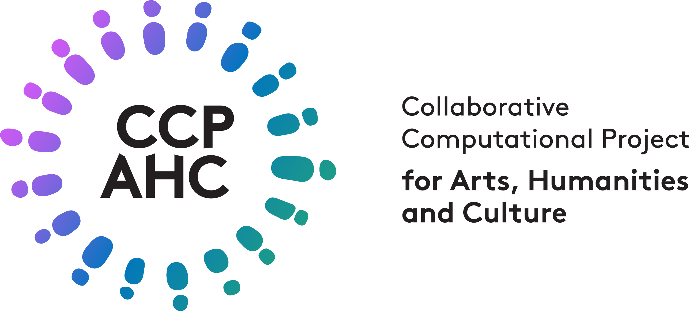

# CCP-AHC

Welcome to **CCP-AHC (Toward a new Collaborative Computational Project for Arts, Humanities, and Culture)** — a UKRI-funded scoping initiative.

Our mission is to support the **sustainable development of research software, workflows, and pipelines** for computationally intensive AHC research, powered by UK Digital Research Infrastructure (DRI).

We are collaboratively developing a **multi-year roadmap** for a new research software community, to be delivered to STFC and UKRI by **end of 2026**.

---

## Get Involved

-   :material-code-braces:{ .lg .middle } __Call for Codes, Workflows, and Pipelines__

    ---

    Help shape the future of computational arts, humanities, and culture (AHC) research by telling us about the tools you own and use. We welcome input from developers, maintainers, and users.

    [:octicons-arrow-right-24: Submit a research software project](./activities/codes-eoi.md)

-   :material-file-document-edit:{ .lg .middle } __Roadmap Open Draft Feedback__

    ---

    Review and comment on the CCP-AHC roadmap. Community feedback is essential to ensuring it reflects real research needs and practices.

    [:octicons-arrow-right-24: Read the draft](https://zenodo.org/records/17099176)  
    [:octicons-arrow-right-24: Comment via Hypothes.is](https://via.hypothes.is/https://www.ccpahc.ac.uk/assets/OPEN%20DRAFT%202025-09-11%20-%20CCP-AHC%20Roadmap%20Open%20Draft.pdf)

---

## Events & Community

-   :material-calendar-star:{ .lg .middle } __CCP-AHC Town Hall 2026__

    ---

    Join us on **17 September 2026** at STFC Rutherford Appleton Laboratory (Oxfordshire), with optional training on 16 September. Hybrid participation available.

    [:octicons-arrow-right-24: Event details](./activities/town-hall-2026/index.md)

-   :material-account-group:{ .lg .middle } __Community Forum (Monthly)__

    ---

    Informal online sessions held on the **second Tuesday of each month (12:30–1:30pm UK time)**. Share experiences and learn about DRI access and workflows.

    [:octicons-arrow-right-24: Join the Community Forum](./activities/community-forum.md)

---

### Previous Events

- [Regional Engagement Event (London, November 2025)](./activities/regional-engagement.md#ccp-ahc-regional-workshop-london-friday-14th-november-2025)  
- [Regional Engagement Event (Edinburgh, November 2025)](./activities/regional-engagement.md#ccp-ahc-regional-workshop-edinburgh-thursday-6th-november-2025)  
- [Regional Engagement Event (Cardiff, October 2025)](./activities/regional-engagement.md#ccp-ahc-regional-workshop-cardiff-wednesday-29th-october-2025)  
- [CCP-AHC Town Hall 2025 (Durham, September 2025)](./activities/town-hall-2025/index.md)

---

## About the Project

-   :material-cogs:{ .lg .middle } __What CCP-AHC Does__

    ---

    We support the development of **research software, workflows, and pipelines** for AHC researchers using UK-based compute infrastructure.

-   :material-sitemap:{ .lg .middle } __Why a CCP?__

    ---

    CCPs have successfully supported scientific software communities for decades. CCP-AHC explores how this model can be applied to AHC research.

    [:octicons-arrow-right-24: Learn about CCPs](https://www.cosec.ac.uk/communities/what-are-ccps/)

-   :material-server:{ .lg .middle } __Focus on Infrastructure__

    ---

    We promote effective use of publicly funded infrastructure, including HPC and advanced computing systems across UKRI and HEIs.

---

## Stay Informed

-   :material-email-newsletter:{ .lg .middle } __Announcements__

    ---

    Receive updates about events, publications, and project milestones.

    [:octicons-arrow-right-24: Subscribe (JISC)](https://www.jiscmail.ac.uk/cgi-bin/wa-jisc.exe?SUBED1=CCP-AHC-ANNOUNCE&A=1)

-   :material-forum:{ .lg .middle } __Discussion List__

    ---

    Join discussions with the community about tools, workflows, and infrastructure.

    [:octicons-arrow-right-24: Subscribe (JISC)](https://www.jiscmail.ac.uk/cgi-bin/wa-jisc.exe?SUBED1=CCP-AHC-DISCUSS&A=1)

---

## Resources & Links

-   :material-github:{ .lg .middle } __GitHub__

    ---

    Explore CCP-AHC repositories and projects.

    [:octicons-arrow-right-24: Visit](https://github.com/ccpahc)

-   :material-database:{ .lg .middle } __Zenodo__

    ---

    Access publications, datasets, and other outputs from CCP-AHC.

    [:octicons-arrow-right-24: Visit](https://zenodo.org/communities/ccpahc/)

---

## Project Team

### Contact

[Email ccpahc@durham.ac.uk](mailto:ccpahc@durham.ac.uk) to contact the team.

### Delivery Team

- [Dr Eamonn Bell](https://www.durham.ac.uk/staff/eamonn-bell/) (Durham University), Project Lead and CCP-AHC Chair
- [Prof Karina Rodriguez-Echavarria](https://research.brighton.ac.uk/en/persons/karina-rodriguez-echavarria) (University of Brighton), Project co-Lead
- [Prof Jeyan Thiyagalingam](https://www.scd.stfc.ac.uk/Pages/sciml-profile-jeyan.aspx) (STFC), Project co-Lead
- Clare Collyer (Durham University), Research Project Manager

### Advisory Group

- Dr Alastair Basden (Durham University)
- Dr Ryan Heuser (University of Cambridge)
- Prof Leif Isaksen (University of Exeter)
- Dr Lisa Otty (University of Edinburgh)
- Dr Zoetanya Sujon (University of the Arts London)
- Prof Melissa Terras (University of Edinburgh)

### Funding

This work is supported by the Science and Technology Facilities Council (STFC) [UKRI/ST/B000494/1]. Funding for 2025-2026 was awarded under the ["Collaborative Computational Communities: towards new CCPs” opportunity](https://www.ukri.org/opportunity/collaborative-computational-communities-towards-new-ccps/) 

